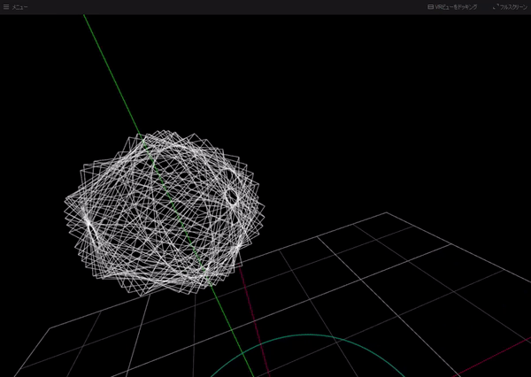

# ofxOpenVrUtil
**openFrameworks addon for bridging [OpenVR](https://github.com/ValveSoftware/openvr)**, a refactored version of [perevalovds/ofxOpenVR](https://github.com/perevalovds/ofxOpenVR).

OpenVR is the open source API to access VR system via [SteamVR](https://store.steampowered.com/steamvr). Main support target is HTC VIVE (I was using VIVE PRO for developping) but it might be compatible to Oculus Rift S, Valve Index or other VR hardwares which can play SteamVR for just displaying a scene. But for major hardware vendors, such like Oculus(facebook) and HTC published native SDK which are supposed to run faster than via OpenVR.



## Feature
* Rendering controllers (mesh + texture)
* Simple interface: just submit texture to show in HMD!

    ```C++
    class ofApp : public ofBaseApp {
    public:
        ofxOpenVrUtil::Interface vr;
        // ...

        void setup() {
            vr.setup();
        }
        void update() {
            // ... update your textures for both eyes

            // submit textures to VR!
            vr.submit(tex_l, vr::Eye_Left);
            vr.submit(tex_r, vr::Eye_Right);
        }
        void exit() {
            vr.close();
        }
    }

    ```

* *VIVE Only:* [Stencil Mesh (Hidden Area Mesh)](https://youtu.be/ya8vKZRBXdw?t=3449) to avoid pixels to be rendererd. (17% faster)
* *VIVE PRO Only:* See-through from stereo-camera on HMD

## Setup
* OpenVR is a submodule of this repo, so we have to `git submodule`

    ```
    > cd of\addon
    > git clone https://github.com/nama-gatsuo/ofxOpenVrUtil
    > git submodule init
    > git submodule update

    ```

* You can then use the OF Project Generator to generate projects with the appropriate headers and libraries included.

## TODO
* Handling controller's input
